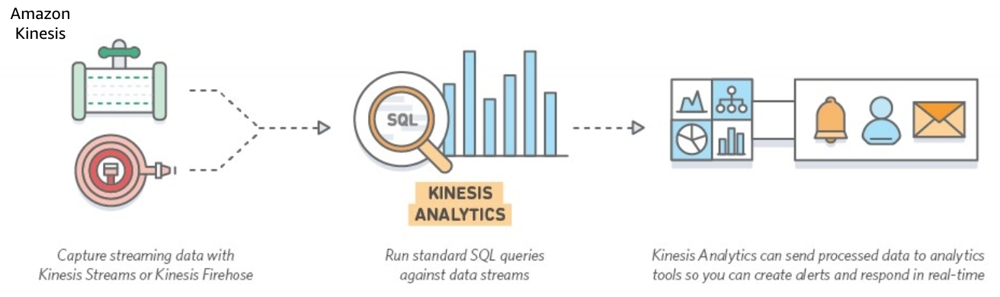
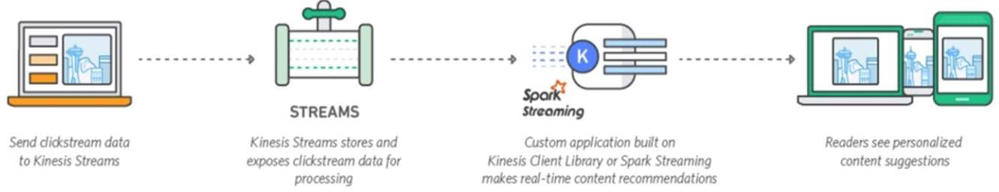

# Kenisis/Analytics

## Kinesis

* Platform for streaming data on AWS
* Build custom streaming data applications 
* Collect, store, analyze terabytes per hour of streaming data from apps, mobile, wearables, IoT
* Load streaming data into AWS services:
  * Kenisis Analytics
  * S3
  * Redshift
  * Elastic Search Service
* Auto-scales 
* Batch, compress, encrypt data before loading - minimizes storage needed at destination and increases security on at-rest

## Kenisis Analytics

* Process the data streaming in with SQL
* Send to analytics tools to create reports and alerts in real-time

## Kenisis Data Streams

* Collect and store streaming data
* Use Spark streaming to make real-time content recommendations
* Users see personalized content

