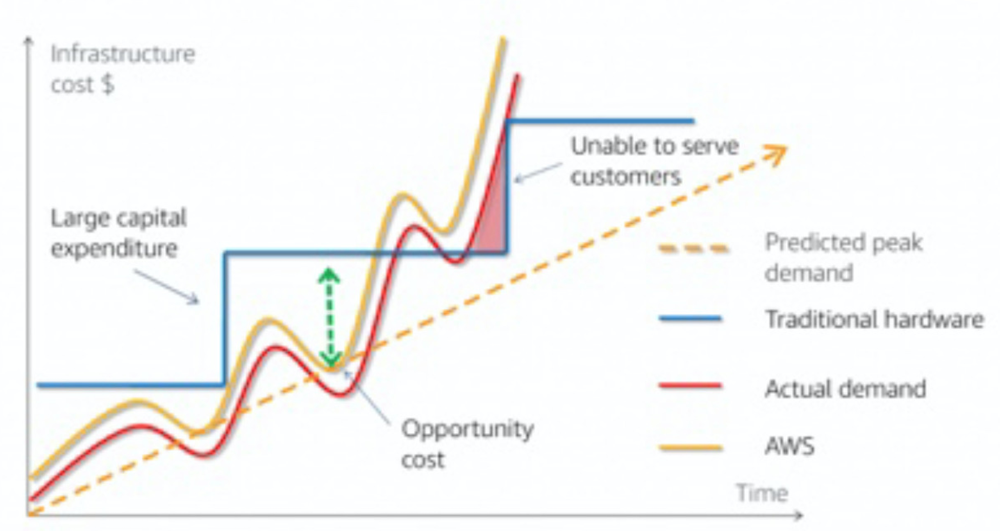

# Cloud Value Framework

Cloud economics = business value and cloud financial management

* **BUSINESS VALUE \(TCO\)**
  * Includes everything that advances your customer's business 
  * Often this conversation happens before the sale, but can be ongoing
  * Includes total cost of ownership, but also much more
  * 4 pillars of business value:
    1. Cost savings \(TCO\) 
       * Consumption-based model
       * AWS pricing model
       * Frequent price reductions
    2. Staff productivity
    3. Operational resilience 
    4. Business agility
* **CLOUD FINANCIAL MANAGEMENT** 
  * Helps customers be financially successful in managing their cloud

