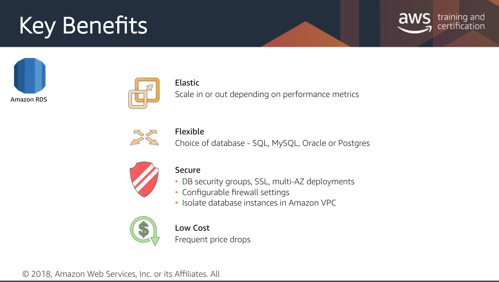

# RDS

## Features

* Cost efficient 
* Resizable 
* Simplifies database administration tasks
* Pay-as-you-go, pay only what you use 
* Flexible - Native access to:
  * MySQL 
  * SQL
  * Oracle
  * PostgreSQL 
    * and versions of each
* Monitor the compute and storage usage \(no additional charge\)
* Low latency with EC2
* Can provision from 1,000 IOPS to 30,000 IOPS per database instance 
* Elastic - scales up or down based on your configurations 
* Secure 

