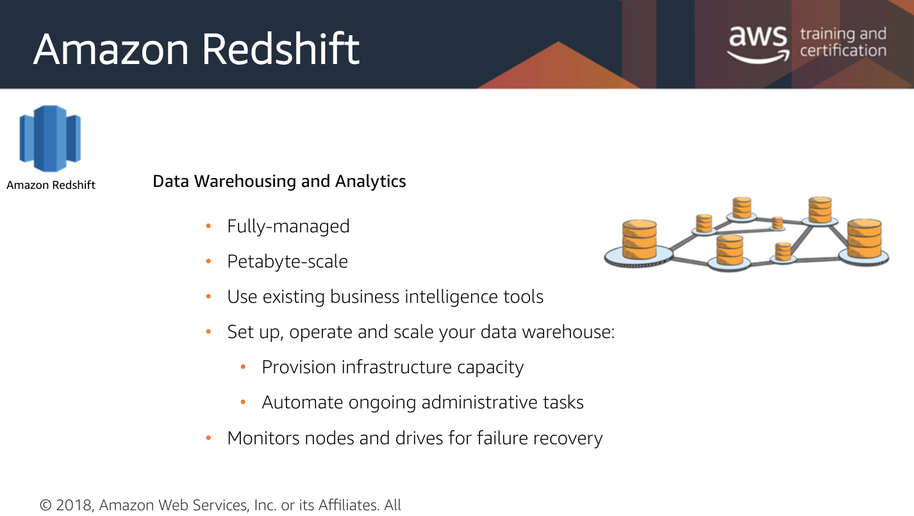
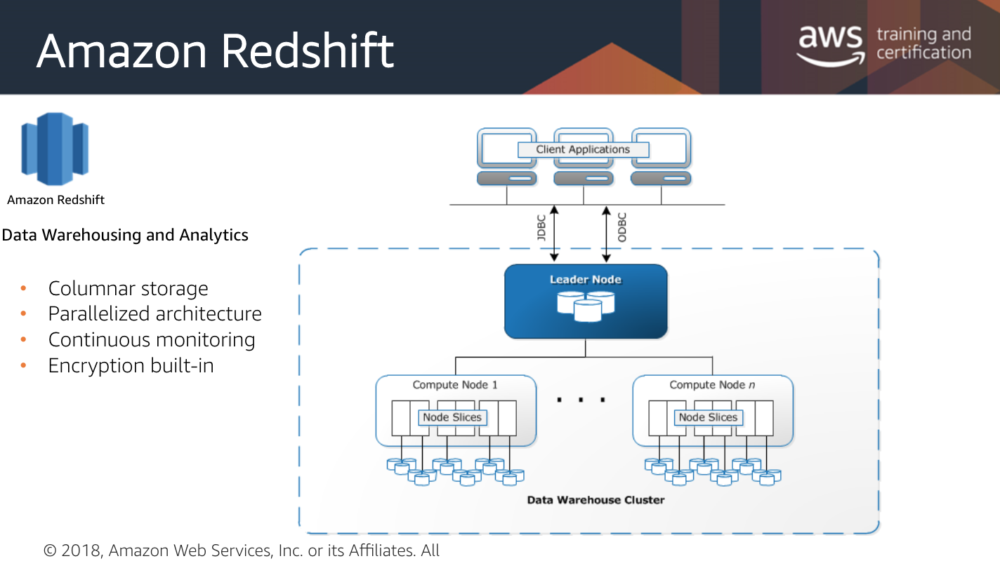
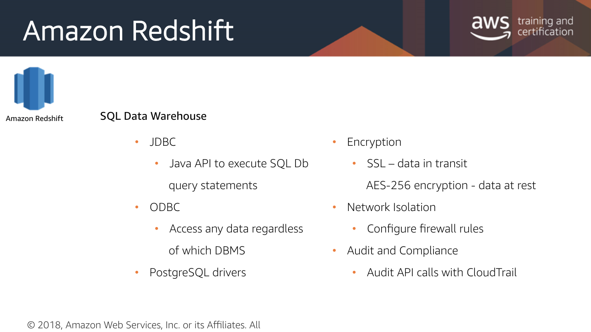

# Redshift

## Features

* Analyze your data using your business intelligence tools 
* Start small at $0.25/hour
* Scale to a petabyte or more at $1,000 USD per terabyte per year 
* Scale up by adding nodes to your cluster with no downtime; AWS will distribute your data for maximum performance, no manual tuning needed
* Passes queries across nodes in cluster for max performance 
* Auto monitoring and backups \(can be used for restore\) 
* Build-in encryption 

## SQL Data Warehouse

* Versatile, useful for Java applications and other standards

## Amazon Redshift vs. AWS Aurora

* [Redshift is OLAP whereas Aurora is OLTP.](https://blog.treasuredata.com/blog/2016/02/10/whats-the-difference-between-aws-redshift-aurora/)

