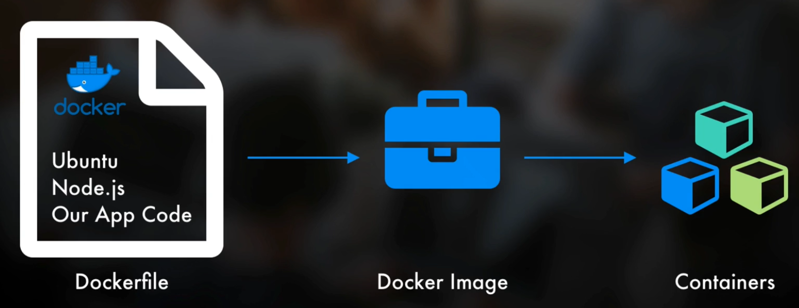

# Docker

Docker

* solidifies the environment for your app
* keeps issues at bay with OS changes
* keeps other apps on servers from being noisy neighbors, causing issues 
* Docker **container** - transferable entity that is everything the app needs
  * Docker **image** - templates for containers 
    * Docker **file** - main config file to say what’s in the Docker container, things like..
      1. OS - Ubuntu Linux
      2. Framework - Node.js
      3. Code - our app code files 
* All the host server needs to run is Docker and can run any apps in a Docker container
* Docker also manages: network configuration, CPU usage, memory, etc. on the host machine
* NOT virtual machines
* Resource Management with Docker & AWS ECS
  * Elastic Container Service - manages Docker containers across all EC2 instances based on the Docker Image that you give it
    * Connects EC2 instances \(the app\) with the Load Balancers, too \(EC2s &lt;—&gt;ECS&lt;—&gt;Bals\)

