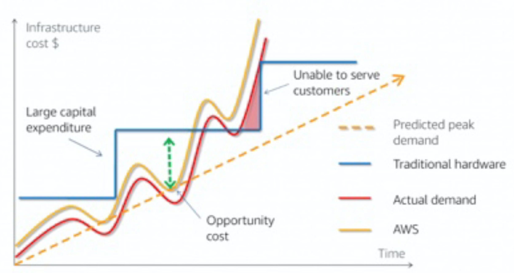

# Cloud Value Framework

Cloud economics = business value and cloud financial management

* Cost savings \(TCO\)
  * 1.Consumption-based model
  * 2.AWS pricing model
  * 3.Frequent price reductions
* Staff productivity
* Operational resilience 
* Business agility

