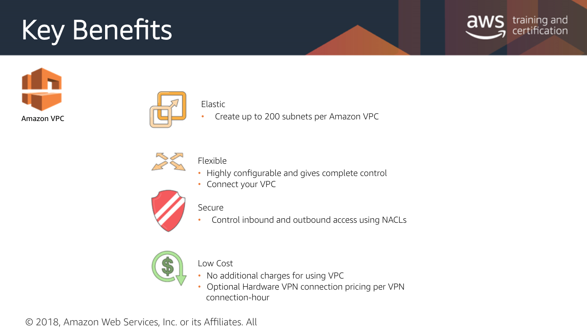

# VPCs

* VPCs - Virtual Private Cloud 
* Networking Rules \(like “the roads” to the building\)
* IAM Rules \(like “the security guard in the building"\)
* Use the AWS Console wizard to create and setup your VPC

