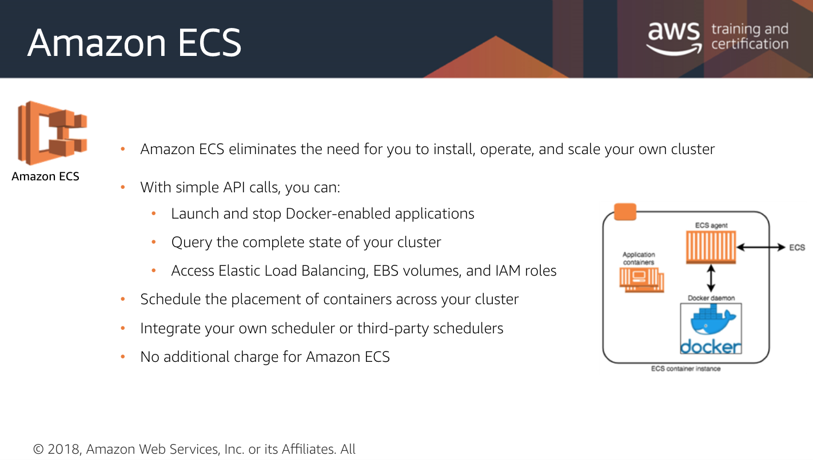

# ECS

Resource Management with Docker & AWS [ECS](https://aws.amazon.com/ecs/)

* Elastic Container Service - manages Docker containers across all EC2 instances based on the Docker Image that you give it
  * Connects EC2 instances \(the app\) with the Load Balancers, too
    * EC2s &lt;—&gt;_ECS_&lt;—&gt;Bals

