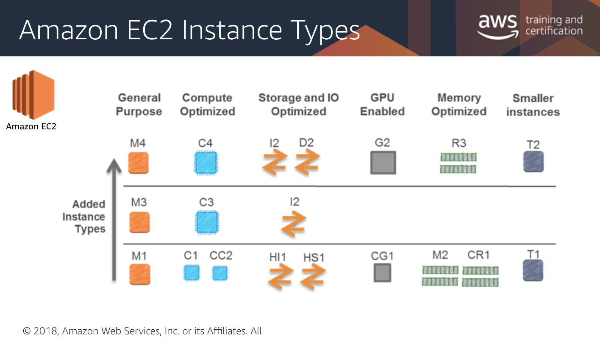

# EC2

EC2 - Virtual Machines - database, servers, load balancer, IP to connect to 

* Dedicated virtual servers
* Pay only for what you use
* Linux
* Bash 
* Control from:
  * AWS Console
  * AWS API
* Can house database here but this is the self-managed option \(yuck\), see [Aurora](../databases/untitled.md) 
* Start with **Amazon Machine Image \(**[**AMI**](https://docs.aws.amazon.com/AWSEC2/latest/UserGuide/AMIs.html)**\)** - choose an operating system type and version \(preconfigured or customized\)

## **Sizing and Types**

From `Micro` to `24xlarge`

* [https://www.ec2instances.info](https://www.ec2instances.info)

**M - General Purpose**

* Balanced CPU and Memory performance
* Examples:
  * Encoding
  * High traffic web content management systems
  * Memory-cached solutions 

**C - Compute Optimized**

* Proportionately more CPU is needed than Memory
* Compute-intensive applications   

**I, D, H - Storage and I/O Optimized**

* High data i/o and storage 

**G, CG - GPU Enabled**

* Graphics processing
* High CPU and Network performance
* Parallel processing for:
  * 3D graphics
  * high performance computing
  * rendering
  * media processing

**R, CR, M - Memory Optimized**

* High throughput applications
* Relational and NoSQL databases
* Memory analytics
* Scientific computing 

**T - Smaller Instances**

* Low-intensity workloads
* Basion hosts
* Dev and test environments
* Learning and experimentation 

## EC2 Pricing

Chose which best fits your project.

* **On-Demand**  - pay by compute hour, no commitments 
* **Reserved** - Make one up-front payment for each instance at a discount \(50-70% lower rate than on-demand\), good for steady-state utilization 
* **Spot** - bid for unused EC2 capacity, good for apps that are not time-dependent, and can be interrupted
* **Dedicated** - dedicated to a single customer; isolated at the hardware level \(single tenant hardware\)

## AWS Marketplace

A place to find and initiate all kinds of projects and apps.

* Pre-configured [AMIs](ec2.md)
* Ready to launch 
* Compare pricing 
* [https://aws.amazon.com/marketplace](https://aws.amazon.com/marketplace)

## **History of EC2/AWS**

* History of virtual machines

