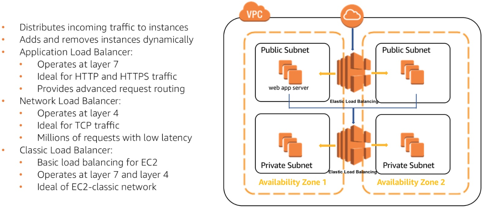

# Load Balancers

Load Balancers - accept incoming traffic and distribute to the webservers that can handle it

* Easy setup: EC2 instance with Nginx, HAproxy, Apache - tell them about your webservers 
* Keeps track of:
  * new webs
  * removed webs
  * session data
  * health checks
  * metrics

