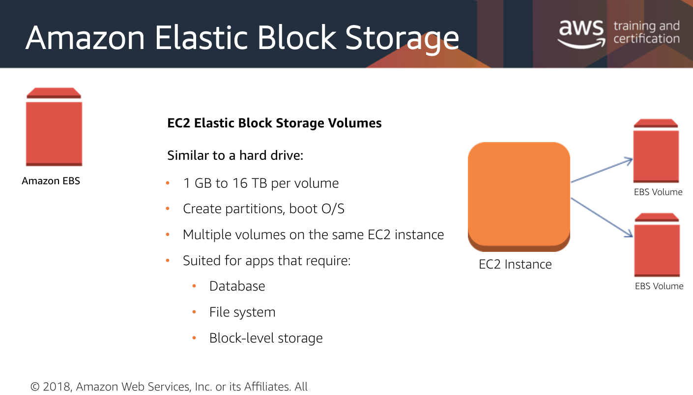
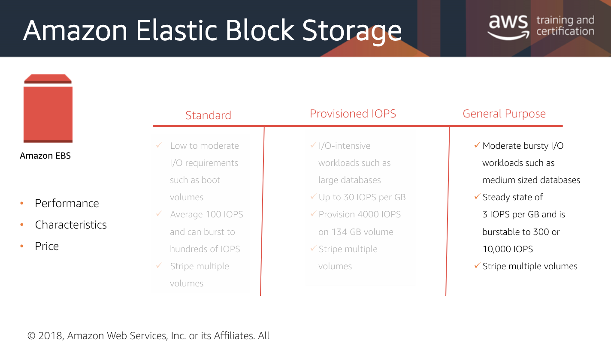

# Amazon EBS

EBS \(Elastic Block Store\) and [S3](untitled.md) are two file storage services provided by Amazon. The main difference between them is with what they can be used with. EBS is specifically meant for [EC2](../servers/server-fleets.md) \(Elastic Computing Cloud\) instances and is not accessible unless mounted to one.

## Durability and Backup

* Automatic replication within it's Availability Zone \(AZ\)
* Incremental snapshot back-up to Amazon S3 \(optional\)

## I/O Provisioning

* Provision a specific level of I/O performance
* Or select a _burstable_ performance model
* Scale to tens of thousands of IOPS per EC2 instance

## Types of EBS Volumes

* Standard
* Provisioned IOPS
* General Purpose

